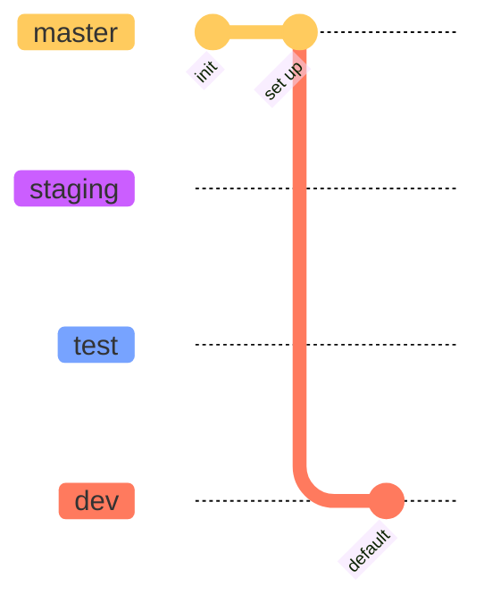
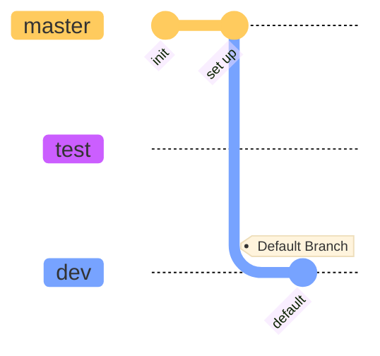
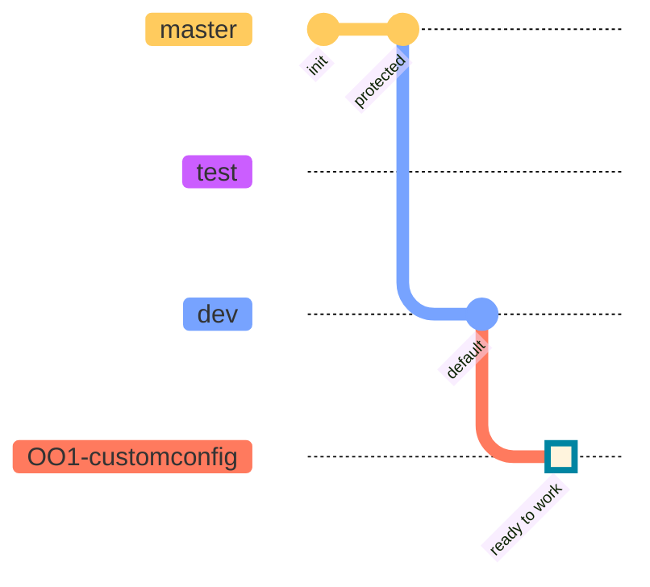
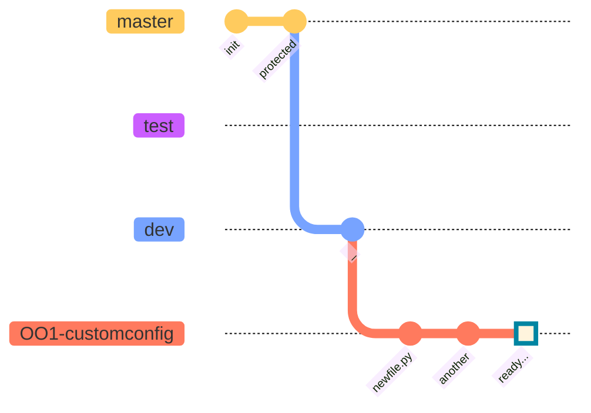
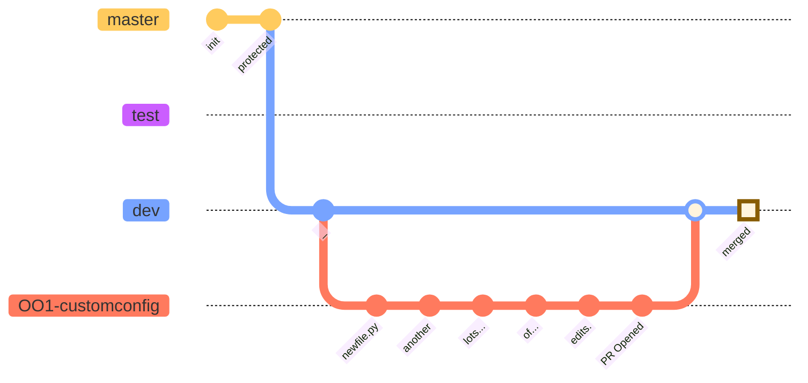
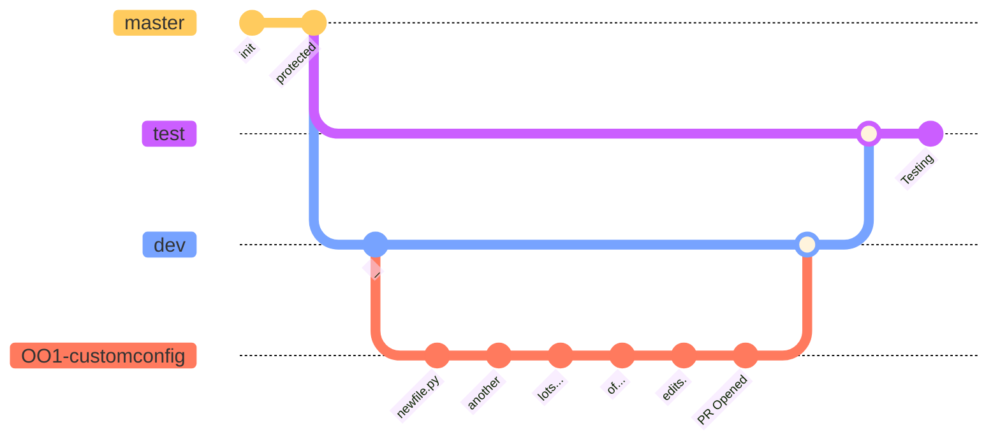
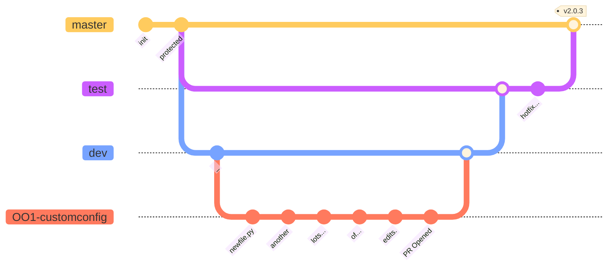
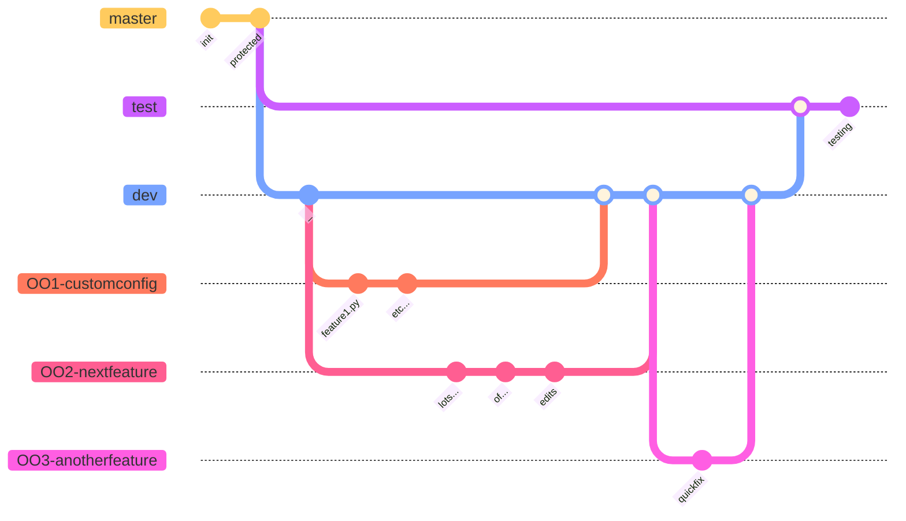

## Set up your Git command space

* Start [here](https://github.com/USGS-WiM/wimfo/blob/dev/General/Onboarding/NewHires/Setup/Training/Git_Basics/Setting_Up_Github.md)
* Keep this [cheat sheet](https://education.github.com/git-cheat-sheet-education.pdf) handy.

## Working with an existing repository 

### Git a local copy of the repo
_NOTE: Examples will use the **[wimfo](https://github.com/USGS-WiM/wimfo/)** repo_
```
> git clone https://github.com/USGS-WiM/wimfo.git
> cd wimfo
> git status
On branch dev
Your branch is up to date with 'origin/dev'.

nothing to commit, working tree clean
```
Notice that you are on branch `dev`

### Repo branches
Assuming that the repo you are working with has been set up according to the
[best practice guidance](https://github.com/USGS-WiM/wimfo/blob/dev/Development/Development_Tools/Git/Setup_New_Repository.md), 
there should already be a few branches set up: 

Those standard branch names correspond to: 

* `master` : The final product, visible to public consumers of the repo. This is 'production' code, after it has been tested. 
* `staging` : This is an optional branch, where a project owner or lead developer will system test the code prior to releasing to master. 
* `test`: Branch where code is aggregated for testing. _(NOTE: Not sure how this differs from `staging`.)_
* `dev`: Daily working branch.  This is the one to branch from in order to do your work. 

The distinction between `staging` and `test` is at the project level, and won't affect day-to-day work for most developers. Here, I'm going
to remove `staging`, and only show `master`, `test`, and `dev`.  The relationshiop between `test`, `dev`, and your personal work can be 
extrapolated to apply to staging also.  Here's the simplified gitGraph for the remaining illustrations: 

The default branch is `dev`.  You should plan to do all of your work off of it. The `master` branch is protected, meaning that if you
work from it, you won't be able to merge your changes back into it without a lot of drama.  Work from `dev': 
```
> git branch
* dev
> git checkout -b nnn-description
```
where `nnn` is the issue number which describes the work you are about to do. And `description` is a human-friendly descriptor of that
work.  In theory, you could name the branch anything, but WIM likes to have the issue number represented in the branch name. Descriptors
are less important (but are really helpful). 

Suppose issue number one is a block of work where we want to implement some sort of customizable configuration to the app we're 
developing: 
```
> git checkout -b 001-customconfig
```
This will put your repository into this state: 

This is often called a 'feature branch': a branch of `dev` intended to capture all of the changes necessary to implement a specific feature. 

### Do the work
This is an iterative loop where you edit files, add them to git, commit those changes. 
```
> edit newfile.py
> git add newfile.py
> git commit -m 'add newfile.py'
[main 3a0741a] add newfile
 1 file changed, 0 insertions(+), 0 deletions(-)
 create mode 100644 newfile.py
 
> edit anotherfile.py
> add anotherfile.py
> git commit -m 'yet another file'
[main 25d61c4] yet another file
 1 file changed, 0 insertions(+), 0 deletions(-)
 create mode 100644 anotherfile.py
 
> git status
On branch dev
Your branch is ahead of 'origin/dev' by 2 commits.
  (use "git push" to publish your local commits)
nothing to commit, working tree clean
```
Some hints: 

* `git add .` : The dot refers to the current folder/directory.  Git will add all files in that folder.  This is a nice shorthand 
  to keep from having to name each file with separate add commands. 
* You can edit multiple files before adding and commiting. This is actually preferred, if those multiple-file edits are 
  coupled to implement a single feature.
* Write good, descriptive commit messages. Opinions vary on what 'good' means. 
  Start [here](https://www.freecodecamp.org/news/how-to-write-better-git-commit-messages/) 
  
Note that most IDEs with good git integration will handle a lot of that for you -- if you happen to run the IDE from the host where 
the code needs to run. Get comfortable with the command line so that you can work anywhere under any conditions. 

### Push your local branch to the github repo
The work you've done with commits is all local to the host where' you are working.  Once you've got a collection of commits that
implement a complete feature or change, you can push your branch to the central repository to share with others. 
```
> git push --set-upstream origin 001-customconfig
Enumerating objects: 11, done.
Counting objects: 100% (11/11), done.
Delta compression using up to 12 threads
Compressing objects: 100% (6/6), done.
Writing objects: 100% (6/6), 1.27 KiB | 1.27 MiB/s, done.
Total 6 (delta 3), reused 0 (delta 0)
remote: Resolving deltas: 100% (3/3), completed with 3 local objects.
remote: 
remote: Create a pull request for '001-customconfig' on GitHub by visiting:
remote:      https://github.com/USGS-WiM/wimfo/pull/new/001-customconfig
remote: 
To https://github.com/USGS-WiM/wimfo.git
 * [new branch]      001-customconfig -> 001-customconfig
Branch '001-customconfig' set up to track remote branch '001-customconfig' from 'origin'.
```
That's a lot of status information... essentially, two things happened: 
* A branch on the `origin` (github repo) is set up to track your local branch. 
* Changes locally were pushed to that origin. 

Future pushes (after, say, another rounds of local changes to the codebase) don't need to set the upstream origin... they can be 
made with a simple `git push` after you've made your local commits. 

The github branches now should look something like this: 


### Pull Request (PR)
This might better be called a 'merge request' to better describe what's happening.  You're asking the repository ownership to
review your changes and merge them into the `dev` branch. 

You can create a merge request by navigating the github repo via your web browser.  A shortcut is to use the pre-formed URL
we got from the status output after we pushed the branch. In the case of the example above, note the URL: 
```
https://github.com/USGS-WiM/wimfo/pull/new/001-customconfig
```
Plug and go. 

Some details for your Pull Request: 
* Important to note that when you create the PR, your 'base' branch is `dev` and 
  the 'compare' branch is the one you've been working on.  In this example, that has been `001-customconfig`. 
* Assign a Reviewer.  Your work group will define who that should be. 
* Add comments and notes. It is possible that a lot of back-and-forth will happen in this threaded conversation which
  may drive further edits. 
* More work can be done on the branch before it is ultimately merged.  The pull request is a nice place to store 
  conversations during the development of a branch's features.  This is especially useful if multiple people will 
  contribute to this branch. 

### Merge
The merge, once reviewed and approved, will apply all changes in your branch to the `dev`  branch. 


### Merge to `test`
At this point, some folks on the team will do system testing.  This does not mean that you have not been testing your
code changes up to this point. Definitely push tested code to `dev`.   But your changes may affect other parts of the project
in ways that escaped your testing scope.  This phase will have a more rigorous test suite to the entire code base. 

The testing folks will merge into `test` to run all of those. That may require that we go back to `dev` to make more changes, 
or perhaps a hotfix can be applied directly to the `test` branch. 


The merge to testing may only be done periodically, after multiple feature branches are merged into `dev`.  

### Merge to `master`
Once all the testing requirements are satisfied, the product manager will permit the merge from `test` to `master`.  In 
this set-up, 'master' is a synonym for 'production'. 

At any point after the feature branch is merged with `dev`, your feature branch can be deleted. This will likely be done
at the time of merging, but could happen later. When merging, the code reviewer could elect to 'squash' commits or not. 

### Release
Once a merge has been made to the `master` branch, a 'release' is created and a version tag assigned. Tags affix convenient
handles to specific points on the git graph. In the above graph, the release on `master` is tagged `v2.0.3`. 

## Other Thoughts...
The graphs above isolate the changes associated with a single feature branch.  But multiple branches can be created by multiple
people, and the various merges need to be handled.  Ideally, all developers will branch from `dev`, so that all of the complex
git graph happen from there.  Merges to `test` and `master` should be fairly drama-free, as they typically have only one sub-branch (the `dev` branch). 

