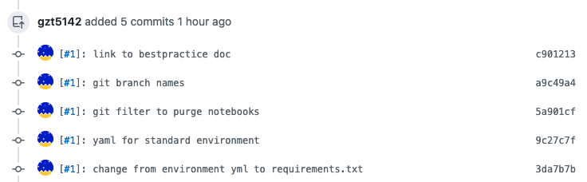

# Git Hooks

Hooks can do a lot of things related to the git workflow. It is possible to run custom scripts before and after key events
like merges and commits. These scripts are run **locally** as part of your working copy of the repository. They do not affect
the github remote. 

This example, we will intercept the commit message just prior to moment when the commit goes into the repository.

The key hook we'll work with is `prepare-commit-msg`.  All hooks are local to your copy of the repository, found in
the `hooks` folder within `$GIT_DIR`.  That typically is in `.git/hooks`.  The scripts here are named for the moment in the
workflow when they are called. Because they are burried in `.git/`, they are not tracked by the repository itself.  

## Create the hook script

Create a new file `<repo_dir>/.git/hooks/prepare-commit-msg` with these contents:

```sh
#!/bin/sh

## We will take an environment variable ISSUE_NO if it exists.
## If not, we will attempt to derive it from the branch name. 
if [ XX = X${ISSUE_NO}X ]; then
  BRANCH_NAME=$(git symbolic-ref --short HEAD)
  ISSUE_NO=$(echo $BRANCH_NAME | sed -n 's/^[^0-9]*-\([0-9]*\).*/\1/p')
fi

if [ XX = X${ISSUE_NO}X ]; then
  # No issue number known. 
  exit 0
fi

sed -i.bak "1s/^/[#$ISSUE_NO]: /" "$1"
```

Make sure that this script has the execute bit set on it (`chmod a+x prepare-commit-msg`).

This script will run any time a commit message is prepared by git. Note that this is designed for use on a unix-like system like
Linux or MacOS.  Also seems to work in a PowerShell on Windows. 

## Usage Notes

* If an environment variable `ISSUE_NO` is set, the value of this variable is taken to be the issue number.
* If you are working on a branch with a 'standard' branch name which includes an issue number (and the 
  `ISSUE_NO` environment variable is not set), the 
  script will try to guess it. It is currently set up to find issue number if the branch name starts 
  with 'xx-000'. This is the WIM convention of using one's initials followed by a dash, followed by 
  an issue number.  The rest of the branch name can be anything.
* If `ISSUE_NO` is set by either of the above two methods, then it is used to prepend a string to the commit message. If not set, then nothing happens and the commit message happens like normal. 

Provided that the issue number can be had (suppose it's "404" for this example), this:
```sh
git commit -m 'my message'
```
will use the string `[#404]: my message` as the commit message when it actually goes into the repository: 
```
> git checkout -b "gt-404-NewFeature"
Switched to a new branch 'gt-404-NewFeature'
> edit newfile.py
> git add newfile.py
> git status -s
A  newfile.py
> git commit -m "my message"
[gt-404-NewFeature 30fd623] [#404]: my message
 1 file changed, 0 insertions(+), 0 deletions(-)
 create mode 100644 newfile.py
> git log -2
30fd623 (HEAD -> gt-404-NewFeature) [#404]: my message
25677b2 (origin/main, origin/HEAD, main) 
```

The issue number was guessed from the branch name, and `[#404]:` was prepended to the supplied commit message.

Even better: this hook is embedded in the standard git logic, so it
applies no matter what tool you use to commit.  With just the hook described
here, the message is modified with commits made via command line, or with
an IDE like `vscode`.

## On Github

A useful side-effect of this is that github recognizes that prepended string
as including an issue number.


What that means in practice is that the commit message is a link to that commit on the revision tree, **and** the issue number is a link to the issue itself.
